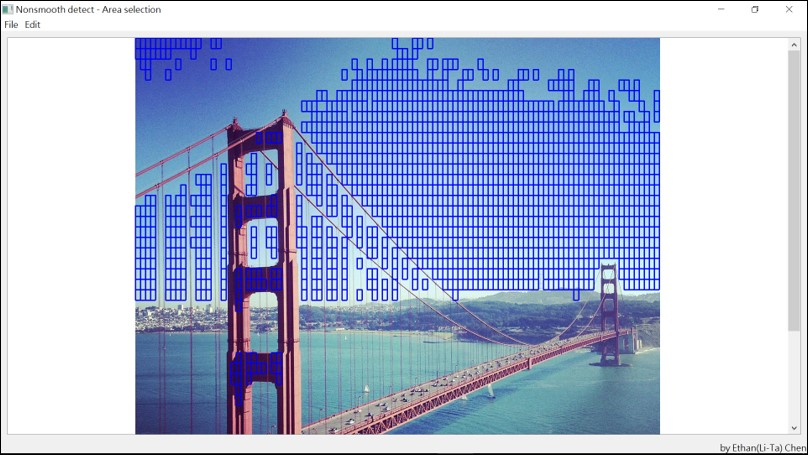
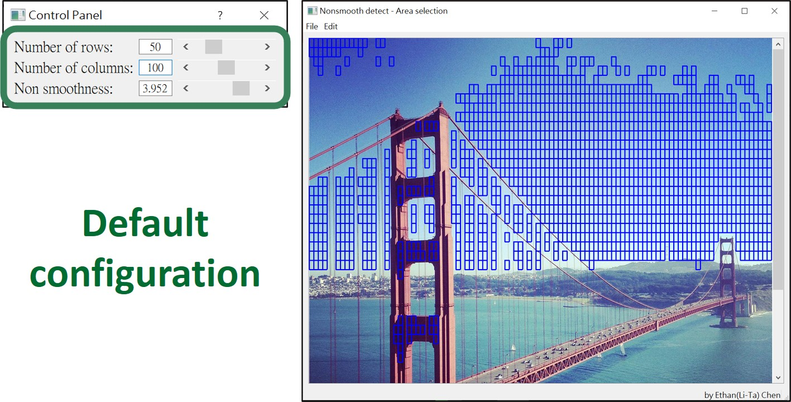
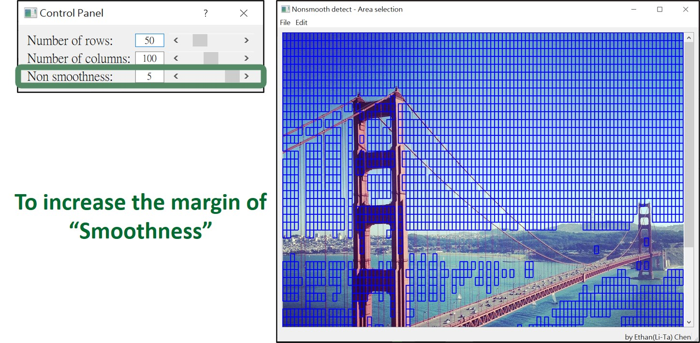
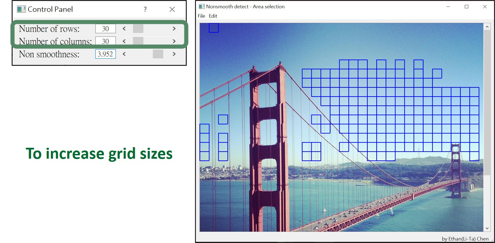
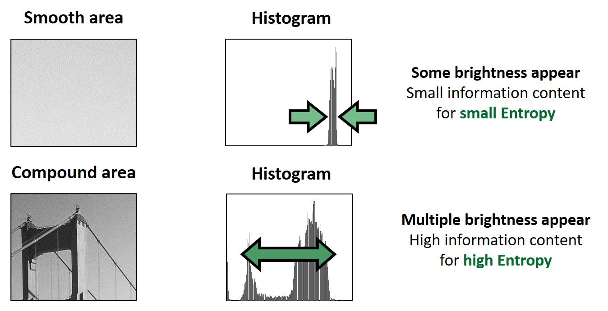

# Smooth area detection

    
   
    

# User interface
The program is able to detect smooth area within the image, to increasing flaxibility there're some parameters available for the user to define how smooth and how large the area to be detected.

**Default configuration**  
To click on "file->Open" to load image (.jpg/.bmp/.png/.tif)

    
   
    

# 3_Control_panel_increasing_criteria

    
   
    

# 4_Control_panel_increasing_grid_sizes

    
   
    

# 5_Entropy

    
   
    

